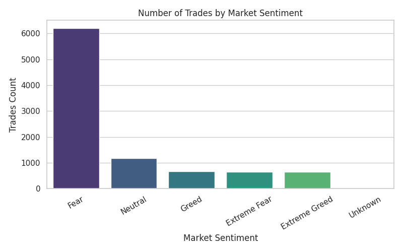
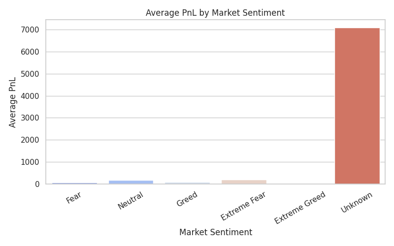

# TradeMind
**Trader Behavior Insights — Relationship Between Market Sentiment & Performance**

##  Project Overview
TradeMind analyzes how trader performance (profitability, trade volume, and trade size) aligns or diverges from overall Bitcoin market sentiment (Fear, Greed, Extreme Fear, Extreme Greed, Neutral). Using two datasets: 1. **Fear & Greed Index** — Sentiment classification per day. 2. **Hyperliquid Trader Data** — Historical trade records with PnL, trade size, and timestamps.

##  Objective
Uncover patterns between trading behavior and market sentiment to help design smarter trading strategies.

##  Repository Structure
TradeMind/  
├── csv_files/  
│   ├── fear_greed_index.csv  
│   ├── historical_data.csv  
├── outputs/  
│   ├── trades_by_sentiment.png  
│   ├── avg_pnl_by_sentiment.png  
│   ├── daily_pnl_sentiment.png  
│   ├── trade_size_distribution.png  
├── ds_report.pdf  

##  Key Insights
- **Fear days** have the highest trade volume but moderate average PnL.  
- **Neutral days** yield higher average PnL with fewer trades.  
- **Extreme Greed** often correlates with lower profitability.  
- Large trade sizes are more frequent during Fear periods.  

##  Sample Visuals
  
  

##  Report
See [`ds_report.pdf`](ds_report.pdf) for complete analysis and recommendations.

##  Tools Used
- Python (pandas, matplotlib, seaborn)  
- Google Colab  
- ReportLab (for PDF generation)  

**Author:** Nila
